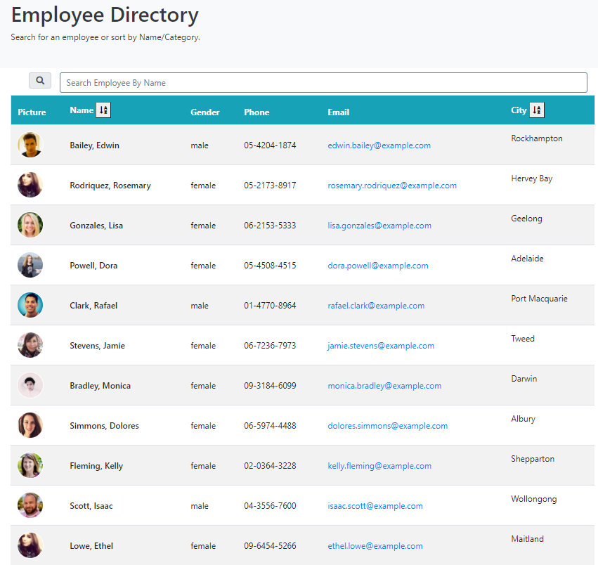

# React: Employee Directory


## Employee Directory

## Live URL
https://serene-tundra-94628.herokuapp.com/

## Description
To  create a employee directory with React. This assignment will require you to break up your application's UI into components, manage component state, and respond to user events.
## Table of Contents
* [License](#license)
* [Installation](#installation)
* [Tests](#tests)
* [Usage](#usage)
* [Credits](#credits)
* [Questions](#questions)

## Installation
``` Install Node.js first, and then run npm install , Install Heroku```
## Tests
``` Terminal Tab 1: mongod  ```
``` Terminal Tab 2: npm install, npm run seed, npm start ```
## Usage
As a user, I want to be able to view my entire employee directory at once so that I have quick access to their information.

An employee or manager would benefit greatly from being able to view non-sensitive data about other employees. It would be particularly helpful to be able to filter employees by name.
## License
MIT

## Credits

* React

## Questions
GitHub: https://github.com/miao0007

Email: miao188@hotmail.com

## Deployed Site Preview

### Web Page



